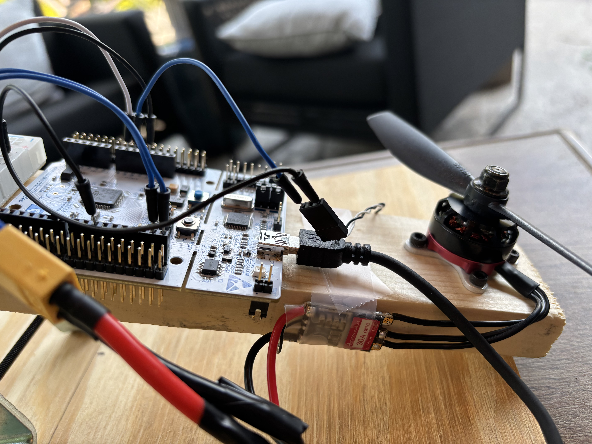
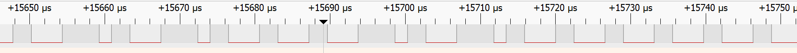

# STM32 One-Axis Brushless Motor Balance Controller

A one-axis self-balancing control system built with an STM32 Nucleo-F411RE, MPU6050 IMU, brushless motor, BLHeli_S ESC, and a custom wooden test rig.

The firmware was developed entirely in Embedded C and implements a complete real-time feedback loop: reading IMU data over I2C, estimating arm angle using a complementary filter, computing PID control corrections, and transmitting throttle commands to a brushless ESC using the DShot150 digital protocol with STM32 timers and DMA.

## Demostration

**Project Demostration (28 seconds)**

Watch the controller initialize, stabilize the balancing platform, and recover from external disturbances.

https://youtu.be/TzGSBiC1iGw


## Features

- Custom DShot150 ESC driver implemented using STM32 timers and DMA
- Real-time closed-loop PID control running at 100 Hz
- MPU6050 IMU interface over I2C
- Complementary filter for sensor fusion and angle estimation
- Modular firmware architecture separating sensor, control, and motor drivers
- Brushless motor control using a BLHeli_S ESC
- Physical one-axis balancing platform for real-world controller validation

## Hardware

The balancing platform consists of a custom-built mechanical test rig driven by a brushless motor and controlled by an STM32 microcontroller. An MPU6050 IMU provides real-time orientation feedback while a BLHeli_S ESC receives digital throttle commands using the DShot150 protocol.

| Component | Description |
|-----------|-------------|
| **Microcontroller** | STM32 Nucleo-F411RE |
| **IMU** | GY-521 MPU6050 6-DOF Accelerometer/Gyroscope |
| **ESC** | HGLRC 30A BLHeli_S ESC |
| **Motor** | AKK RS2205 2300KV Brushless Motor |
| **Battery** | OVONIC 3S 1300mAh 50C LiPo |
| **Test Rig** | Custom-built one-axis wooden balancing platform |

<p align="center">
  
</p>

<p align="center">
<i>Completed one-axis balancing platform used for PID controller development and tuning.</i>
</p>


## System Architecture


The controller is implemented as a closed-loop embedded control system. During each control cycle, the STM32 acquires IMU measurements, estimates the current arm angle, computes a PID correction, and transmits a new DShot150 throttle command to the ESC. This process repeats continuously at a 100 Hz update rate, allowing the system to maintain stability and recover from external disturbances.

```text
                    +------------------+
                    |   MPU6050 IMU    |
                    | (Accel + Gyro)   |
                    +--------+---------+
                             |
                         I2C Communication
                             |
                             ▼
                  +----------------------+
                  | STM32 Nucleo-F411RE  |
                  |                      |
                  |  • Gyro Calibration  |
                  |  • Low-Pass Filter   |
                  |  • Complementary     |
                  |    Filter            |
                  |  • PID Controller    |
                  |  • DShot150 Driver   |
                  +----------+-----------+
                             |
                    DMA + Timer PWM
                             |
                             ▼
                  +----------------------+
                  |    BLHeli_S ESC      |
                  +----------+-----------+
                             |
                    Brushless Motor
                             |
                             ▼
                     Produces Control Torque
                             |
                             ▼
                  Rotates Balance Arm
                             ▲
                             |
                 MPU6050 Measures Angle
```


## Software Architecture

The firmware is organized into modular drivers and control components, separating hardware interfaces from the feedback control algorithm. This modular architecture simplifies debugging, improves maintainability, and allows individual subsystems to be developed and tested independently before full system integration.

```text
Core
├── Inc
│   ├── Controller.h
│   ├── DShot.h
│   ├── MPU6050.h
│   └── main.h
│
└── Src
    ├── Controller.c
    ├── DShot.c
    ├── MPU6050.c
    └── main.c
```

Each module was developed and validated independently before being integrated into the complete balancing system.

### main.c

The main application initializes the hardware peripherals, calibrates the IMU during startup, starts the periodic control loop, and coordinates communication between each subsystem.

Responsibilities:
- System initialization
- Peripheral configuration
- IMU calibration
- Timer interrupt initialization
- Main control loop coordination

  
---

### MPU6050 Driver

Interfaces with the MPU6050 over I2C to configure the sensor and acquire accelerometer and gyroscope measurements used for attitude estimation.

Responsibilities:
- Sensor initialization
- Raw accelerometer and gyroscope acquisition
- Gyroscope bias calibration

---

### Controller

Processes the IMU measurements to estimate the current arm angle and compute the required motor command.

Responsibilities:
- Gyroscope low-pass filtering
- Complementary filter
- Angle estimation
- PID feedback controller
- Throttle calculation

---

<p align="center">
  
</p>

<p align="center">
<i>STM32 Nucleo-F411RE, MPU6050 IMU, and supporting circuitry used to acquire sensor data and execute the real-time feedback controller.</i>
</p>


### DShot Driver

Implements the DShot150 digital motor control protocol by constructing throttle packets, calculating checksums, and generating precisely timed waveforms using STM32 timers and DMA.

Responsibilities:
- DShot packet generation
- Checksum calculation
- DMA waveform transmission
- ESC communication


## Control Algorithm

The controller operates as a real-time closed-loop feedback system running at **100 Hz**. During each control cycle, the STM32 acquires new IMU measurements, estimates the current arm angle, computes the required motor correction, and transmits a new DShot150 command to the ESC.

```text
          MPU6050
      (Accel + Gyro)
             │
             ▼
    Gyroscope Calibration
             │
             ▼
     Gyro Low-Pass Filter
             │
             ▼
     Complementary Filter
             │
             ▼
    Current Arm Angle
             │
             ▼
       PID Controller
             │
             ▼
     Throttle Correction
             │
             ▼
      DShot150 Driver
             │
             ▼
       ESC + Motor
             │
             ▼
      Physical Balance Arm
             │
             └───────────────┐
                             │
                MPU6050 Measures Angle
```

### Sensor Processing

Each control cycle begins by reading the accelerometer and gyroscope from the MPU6050 over I2C.

The gyroscope is calibrated during startup to remove sensor bias before a low-pass filter reduces measurement noise. Accelerometer and gyroscope measurements are then fused using a complementary filter, providing a fast and stable estimate of the arm angle while minimizing long-term drift.

### Closed-Loop Control

The estimated arm angle is continuously compared to the desired target angle to determine the control error.

A PID controller computes the required throttle correction using:

- **Proportional (P):** Responds to the current angle error.
- **Integral (I):** Eliminates small steady-state errors caused by gravity and changing operating conditions.
- **Derivative (D):** Uses filtered gyroscope measurements to damp oscillations and improve stability.

To better match the asymmetric dynamics of the physical system, separate proportional and derivative gains are used depending on the direction of motion.

### Motor Command Generation

The controller output is combined with an experimentally determined base throttle before being encoded into a DShot150 packet.

The packet is transmitted using an STM32 timer and DMA, allowing the ESC to receive precisely timed digital throttle commands while the CPU continues executing the remainder of the control loop.

<p align="center">
  
</p>

<p align="center">
<i>Brushless motor, BLHeli_S ESC, and power electronics used to execute DShot150 throttle commands generated by the STM32.</i>
</p>


## DShot150 Digital Motor Control

Instead of using traditional PWM or OneShot protocols, this project communicates with the ESC using the DShot150 digital motor control protocol.

DShot provides deterministic digital communication between the microcontroller and the ESC, eliminating calibration requirements while improving reliability and timing accuracy.

### Packet Generation

Each throttle command is encoded into a 16-bit DShot packet containing:

- 11-bit throttle value
- 1 telemetry request bit
- 4-bit checksum

The checksum is calculated using the three packet nibbles before transmission, allowing the ESC to detect corrupted packets.

### DMA-Based Transmission

Generating DShot waveforms entirely in software requires precise timing while simultaneously executing the control algorithm.

To achieve this, an STM32 timer generates the PWM waveform while DMA updates the timer compare register with the pulse widths corresponding to each DShot bit.

This hardware-assisted approach enables precise waveform generation with minimal CPU overhead while maintaining deterministic packet timing.

<p align="center">
  
</p>

<p align="center">
<i>Logic analyzer capture verifying the DShot150 waveform generated using STM32 timers and DMA.</i>
</p>

### Transmission Sequence

```text
Throttle Command
        │
        ▼
Build 16-bit DShot Packet
        │
        ▼
Calculate Checksum
        │
        ▼
Convert Bits to PWM Pulse Widths
        │
        ▼
Load DMA Buffer
        │
        ▼
Timer + DMA Generate Waveform
        │
        ▼
ESC Receives Packet
        │
        ▼
Motor Speed Updated

```

## Results

The completed controller successfully maintains the balance arm near the target angle while recovering from external disturbances. The final system demonstrates stable real-time feedback control on a physical test platform using a custom DShot motor driver and onboard sensor fusion.

Key outcomes include:

- Stable closed-loop balancing at a **100 Hz** control rate
- Custom DShot150 driver implemented using STM32 timers and DMA
- Reliable brushless motor control using a BLHeli_S ESC
- Consistent angle estimation using complementary filtering
- Recovery from manual disturbances while maintaining stability
- Modular firmware architecture separating sensor, control, and motor control subsystems


## Development Challenges

Building a reliable closed-loop control system required solving several hardware and firmware challenges throughout development.

### Designing a Custom DShot Driver

Rather than using a standard PWM interface, the project communicates with the ESC using the DShot150 digital protocol. This required implementing packet generation, checksum calculation, and waveform transmission entirely in firmware.

To achieve the required timing accuracy, STM32 timers and DMA were used to generate the waveform with minimal CPU overhead.

---

### Developing Reliable Angle Estimation

Raw gyroscope measurements contain bias and drift, while accelerometer measurements are inherently noisy.

To obtain a stable angle estimate, the controller:

- Calibrates the gyroscope during startup
- Applies a low-pass filter to gyroscope measurements
- Uses a complementary filter to combine accelerometer and gyroscope data

This provides fast short-term response while maintaining long-term stability.

---

### Controller Tuning

The physical dynamics of the balance arm required iterative tuning of the PID controller.

Multiple rounds of testing were performed to determine:

- Base throttle required to counter gravity
- Stable proportional and derivative gains
- Integral limits to reduce steady-state error
- Different controller gains depending on the direction of motion

The final controller is capable of recovering from external disturbances while maintaining the arm near the target angle.

---

### Hardware Validation

Several debugging tools and techniques were used throughout development, including:

- UART serial debugging
- Oscilloscope measurements
- Logic analyzer verification of DShot timing
- Incremental subsystem validation before integrating the complete controller

These tools were essential for verifying correct communication between the STM32, IMU, and ESC during development.


## Lessons Learned

This project reinforced several important principles of embedded systems development and real-time control design:

- Developing and validating individual subsystems before full integration significantly simplified debugging and reduced development time.
- Hardware peripherals such as timers, DMA, and communication interfaces can dramatically reduce CPU overhead while improving timing determinism.
- Real-world control systems must account for sensor noise, mechanical friction, actuator dynamics, and battery voltage variation in addition to theoretical controller design.
- Effective embedded development requires both firmware and hardware debugging, making tools such as UART logging, oscilloscopes, and logic analyzers essential throughout the development process.
